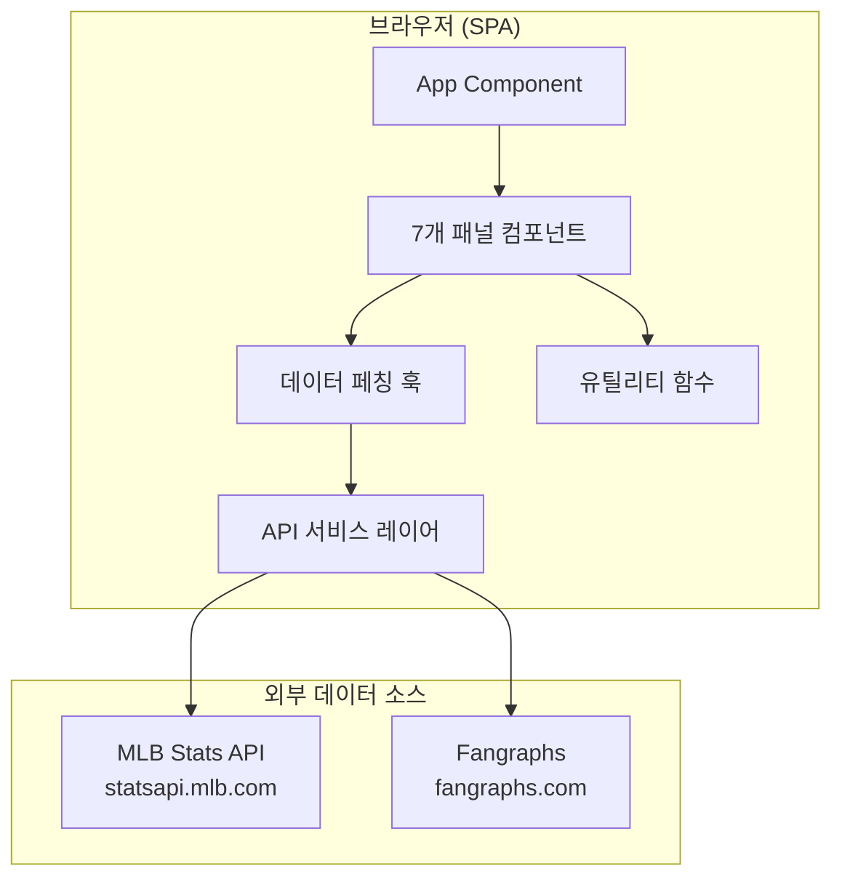
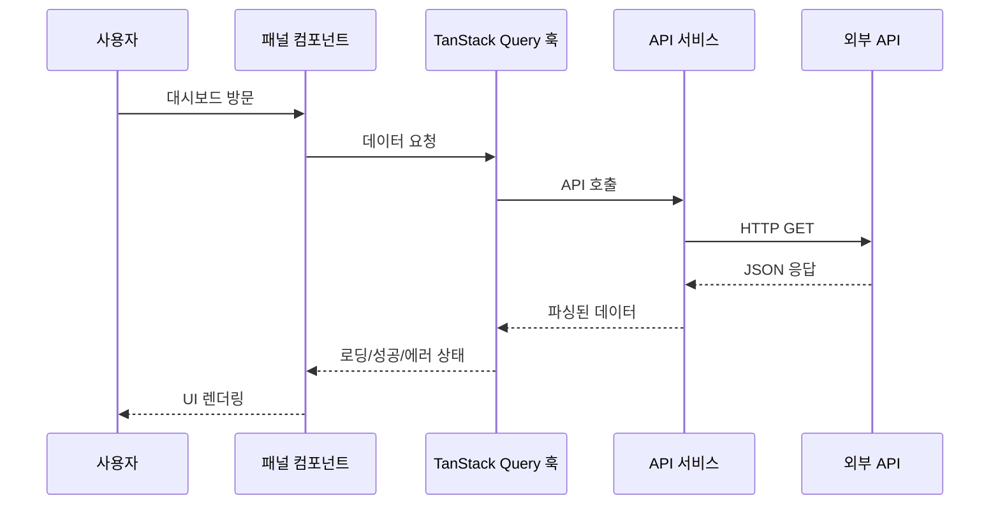

# 설계 문서: Tampa Bay Rays 분석 대시보드

## 개요

Tampa Bay Rays 분석 대시보드는 [jays.baby](https://jays.baby)를 모델로 한 단일 페이지 웹 애플리케이션이다. React 기반 프론트엔드로 구현하며, 공개 야구 데이터 API(MLB Stats API, Fangraphs)에서 데이터를 가져와 7개 분석 패널을 렌더링한다.

주요 설계 결정:
- **프론트엔드 전용 아키텍처**: 별도 백엔드 서버 없이 클라이언트에서 직접 API 호출
- **React + TypeScript**: 타입 안전성과 컴포넌트 재사용성 확보
- **Vite**: 빠른 빌드 및 개발 환경
- **TanStack Query**: 데이터 페칭, 캐싱, 재시도 로직 관리
- **Tailwind CSS**: 반응형 레이아웃 및 유틸리티 기반 스타일링
- **Recharts**: Sparkline 및 차트 렌더링

## 아키텍처



### 데이터 흐름



## 컴포넌트 및 인터페이스

### 디렉토리 구조

```
src/
├── components/
│   ├── common/
│   │   ├── LoadingSpinner.tsx
│   │   ├── ErrorMessage.tsx
│   │   ├── Sparkline.tsx
│   │   ├── TrendIndicator.tsx
│   │   └── TabGroup.tsx
│   ├── PlayoffOddsPanel.tsx
│   ├── RecordTracker.tsx
│   ├── HotColdMLBPanel.tsx
│   ├── HotColdMiLBPanel.tsx
│   ├── PacePanel.tsx
│   ├── SchedulePanel.tsx
│   └── ScoutingPanel.tsx
├── hooks/
│   ├── usePlayoffOdds.ts
│   ├── useRecordTracker.ts
│   ├── useHotColdMLB.ts
│   ├── useHotColdMiLB.ts
│   ├── usePace.ts
│   ├── useSchedule.ts
│   └── useScouting.ts
├── services/
│   ├── mlbApi.ts
│   ├── fangraphsApi.ts
│   └── types.ts
├── utils/
│   ├── stats.ts
│   ├── sorting.ts
│   ├── filtering.ts
│   └── extrapolation.ts
├── App.tsx
└── main.tsx
```

### 주요 컴포넌트 인터페이스

```typescript
// 공통 패널 Props
interface PanelProps {
  title: string;
  lastUpdated?: Date;
}

// 플레이오프 확률 패널
interface PlayoffOddsPanelProps extends PanelProps {
  odds: number;          // 0-100 백분율
  weeklyTrend: number;   // 양수/음수 변동값
}

// 기록 트래커 패널
interface RecordTrackerProps extends PanelProps {
  season2025: SeasonRecord;
  season2026: SeasonRecord;
  alEastStandings: TeamStanding[];
}

// Hot/Cold MLB 패널
interface HotColdMLBPanelProps extends PanelProps {
  window: 7 | 14;
  hotHitters: PlayerStats[];
  coldHitters: PlayerStats[];
  hotPitchers: PlayerStats[];
  coldPitchers: PlayerStats[];
}

// Hot/Cold MiLB 패널
interface HotColdMiLBPanelProps extends PanelProps {
  affiliates: Affiliate[];
  selectedAffiliate: string;
  hitters: PlayerStats[];
  pitchers: PlayerStats[];
}

// 페이스 패널
interface PacePanelProps extends PanelProps {
  hitterPace: HitterPaceStats[];
  pitcherPace: PitcherPaceStats[];
}

// 일정 패널
interface SchedulePanelProps extends PanelProps {
  upcomingGames: ScheduledGame[];
}

// 스카우팅 패널
interface ScoutingPanelProps extends PanelProps {
  opponent: OpponentData;
  window: 7 | 14 | 30;
  view: 'hotcold' | 'wrcplus' | 'fip';
}
```

### API 서비스 인터페이스

```typescript
// MLB Stats API 서비스
interface MLBApiService {
  getTeamRoster(teamId: number, season: number): Promise<Player[]>;
  getTeamSchedule(teamId: number, startDate: string, endDate: string): Promise<Game[]>;
  getStandings(leagueId: number, season: number): Promise<Standing[]>;
  getPlayerStats(playerId: number, group: 'hitting' | 'pitching', season: number): Promise<Stats>;
  getGameLog(playerId: number, season: number): Promise<GameLogEntry[]>;
}

// Fangraphs 데이터 서비스
interface FangraphsService {
  getPlayoffOdds(teamAbbr: string): Promise<PlayoffOddsData>;
  getLeaderboard(params: LeaderboardParams): Promise<LeaderboardEntry[]>;
}
```

## 데이터 모델

```typescript
// 선수 기본 정보
interface Player {
  id: number;
  fullName: string;
  position: string;
  team: string;
}

// 타자 통계
interface HitterStats {
  playerId: number;
  name: string;
  position: string;
  pa: number;           // 타석 수
  wOBA: number;         // Weighted On-Base Average
  wRCPlus: number;      // Weighted Runs Created Plus
  ops: number;          // OPS
  hr: number;           // 홈런
  hits: number;         // 안타
  rbi: number;          // 타점
  sb: number;           // 도루
}

// 투수 통계
interface PitcherStats {
  playerId: number;
  name: string;
  position: string;
  ip: number;           // 투구 이닝
  fip: number;          // Fielding Independent Pitching
  era: number;          // ERA
  wins: number;         // 승리
  strikeouts: number;   // 탈삼진
}

// 시즌 기록
interface SeasonRecord {
  season: number;
  wins: number;
  losses: number;
  gamesPlayed: number;
  winPct: number;       // 소수점 셋째 자리
}

// 디비전 순위
interface TeamStanding {
  teamName: string;
  wins: number;
  losses: number;
  winPct: number;
  gamesBehind: number;
}

// 플레이오프 확률
interface PlayoffOddsData {
  currentOdds: number;      // 0-100
  previousWeekOdds: number; // 0-100
  trend: number;            // currentOdds - previousWeekOdds
}

// 일정 경기 정보
interface ScheduledGame {
  date: string;
  opponent: string;
  isHome: boolean;
  probablePitcher: ProbablePitcher | null;  // null = TBD
  opponentTeamERA: number;
  opponentTeamOPS: number;
}

// 선발 투수 정보
interface ProbablePitcher {
  name: string;
  lastThreeStarts: PitcherGameLog[];
}

// 투수 경기 기록
interface PitcherGameLog {
  date: string;
  opponent: string;
  ip: number;
  era: number;
  strikeouts: number;
  result: 'W' | 'L' | 'ND';
}

// 페이스 예측 (타자)
interface HitterPaceStats {
  player: Player;
  currentStats: { hr: number; hits: number; rbi: number; sb: number; gamesPlayed: number };
  projectedStats: { hr: number; hits: number; rbi: number; sb: number };
}

// 페이스 예측 (투수)
interface PitcherPaceStats {
  player: Player;
  currentStats: { wins: number; strikeouts: number; ip: number; gamesPlayed: number };
  projectedStats: { wins: number; strikeouts: number; ip: number };
}

// 스파크라인 데이터 포인트
interface SparklineDataPoint {
  date: string;
  value: number;
}

// 스카우팅 선수 카드
interface ScoutingPlayerCard {
  player: Player;
  stat: number;              // wRC+ 또는 FIP
  sparklineData: SparklineDataPoint[];
  isProbableStarter: boolean;
  colorClass: 'green' | 'red' | 'neutral';
}

// Quality Gate 설정
interface QualityGate {
  window: 7 | 14 | 30;
  minPA: number;    // 타자 최소 타석
  minIP: number;    // 투수 최소 이닝
}

// Quality Gate 상수
const QUALITY_GATES: Record<number, QualityGate> = {
  7:  { window: 7,  minPA: 10, minIP: 2 },
  14: { window: 14, minPA: 15, minIP: 3 },
  30: { window: 30, minPA: 30, minIP: 6 },
};

// Cold 목록 임계값
const COLD_THRESHOLDS = {
  hitterWOBA: 0.290,    // 미만이면 Cold
  pitcherFIP: 3.75,     // 초과이면 Cold
};
```

## 정확성 속성 (Correctness Properties)

*속성(Property)은 시스템의 모든 유효한 실행에서 참이어야 하는 특성 또는 동작이다. 속성은 사람이 읽을 수 있는 명세와 기계가 검증할 수 있는 정확성 보장 사이의 다리 역할을 한다.*

### Property 1: 추세값 계산 정확성

*For any* 두 유효한 플레이오프 확률 값(현재값, 이전값)에 대해, 추세값은 반드시 현재값 - 이전값과 같아야 한다.

**Validates: Requirements 2.2**

### Property 2: 추세 표시기 렌더링 정확성

*For any* 추세값에 대해, 양수이면 긍정적 시각 표시(녹색/상향 화살표)를, 음수이면 부정적 시각 표시(적색/하향 화살표)를, 0이면 중립 표시를 렌더링해야 한다.

**Validates: Requirements 2.3, 2.4**

### Property 3: 승률 계산 정확성

*For any* 유효한 승-패 기록(wins >= 0, losses >= 0, wins + losses > 0)에 대해, 표시되는 승률은 wins / (wins + losses)를 소수점 셋째 자리로 반올림한 값과 같아야 한다.

**Validates: Requirements 3.2**

### Property 4: 타자 wOBA 내림차순 정렬

*For any* wOBA 값을 가진 타자 목록에 대해, 정렬 함수를 적용한 결과는 각 원소의 wOBA가 다음 원소의 wOBA 이상인 내림차순이어야 한다.

**Validates: Requirements 4.2, 5.2, 8.2**

### Property 5: 투수 성적 오름차순 정렬

*For any* FIP(또는 ERA) 값을 가진 투수 목록에 대해, 정렬 함수를 적용한 결과는 각 원소의 값이 다음 원소의 값 이하인 오름차순이어야 한다.

**Validates: Requirements 4.3, 5.3**

### Property 6: Cold 목록 임계값 필터링

*For any* 선수 통계 목록에 대해, Cold 목록에 포함된 타자는 모두 wOBA < 0.290이어야 하고, Cold 목록에 포함된 투수는 모두 FIP > 3.75이어야 한다. 역으로, 이 임계값을 충족하지 않는 선수는 Cold 목록에 포함되지 않아야 한다.

**Validates: Requirements 4.4, 4.5**

### Property 7: Hot/Cold 목록 상호 배타성

*For any* 선수 통계 목록에 대해, Hot 목록과 Cold 목록의 교집합은 반드시 공집합이어야 한다. 즉, 동일 선수가 두 목록에 동시에 나타날 수 없다.

**Validates: Requirements 4.6**

### Property 8: 선형 외삽 계산 정확성

*For any* 유효한 현재 누적 통계(stat > 0)와 경기 수(gamesPlayed > 0, gamesPlayed <= 162)에 대해, 예측값은 stat × (162 / gamesPlayed)와 같아야 한다.

**Validates: Requirements 6.1, 6.2**

### Property 9: Quality Gate 필터링

*For any* trailing window(7, 14, 30일)와 선수 목록에 대해, 표시되는 타자는 모두 해당 window의 최소 PA 이상이어야 하고, 표시되는 투수는 모두 해당 window의 최소 IP 이상이어야 한다.

**Validates: Requirements 8.5, 8.6, 8.7**

### Property 10: 예상 선발 투수 별표 표시

*For any* isProbableStarter가 true인 선수에 대해, 렌더링된 출력에는 반드시 별표(*)가 포함되어야 한다.

**Validates: Requirements 8.3**

### Property 11: 미정 선발 투수 TBD 표시

*For any* probablePitcher가 null인 예정 경기에 대해, 해당 경기의 선발 투수 표시 영역에는 반드시 "TBD"가 표시되어야 한다.

**Validates: Requirements 7.5**

### Property 12: 순위표 데이터 완전성

*For any* 유효한 순위표 데이터에 대해, 렌더링된 출력에는 각 팀의 승, 패, 승률, 게임차가 모두 포함되어야 한다.

**Validates: Requirements 3.4**

## 오류 처리

### API 오류 처리 전략

| 오류 유형 | 처리 방식 |
|-----------|-----------|
| 네트워크 오류 | 해당 섹션에 오류 메시지 표시, 재시도 버튼 제공 |
| 타임아웃 (10초) | 요청 취소, 타임아웃 메시지 표시, 재시도 옵션 |
| HTTP 4xx | 오류 메시지 표시, 로그 기록 |
| HTTP 5xx | 오류 메시지 표시, 자동 재시도 (최대 3회, 지수 백오프) |
| 파싱 오류 | 해당 섹션에 "데이터 처리 오류" 메시지 표시 |

### 오류 격리 원칙

- 각 패널은 독립적으로 데이터를 로드하며, 한 패널의 오류가 다른 패널에 영향을 주지 않는다
- TanStack Query의 `useQuery` 훅을 패널별로 분리하여 오류 경계를 구현한다
- React Error Boundary를 각 패널에 적용하여 렌더링 오류도 격리한다

### 오류 메시지 컴포넌트

```typescript
interface ErrorMessageProps {
  message: string;
  onRetry?: () => void;
  showRetry: boolean;
}
```

### TanStack Query 설정

```typescript
const queryConfig = {
  staleTime: 5 * 60 * 1000,      // 5분간 캐시 유효
  retry: 3,                        // 최대 3회 재시도
  retryDelay: (attempt: number) => Math.min(1000 * 2 ** attempt, 30000),
  timeout: 10000,                  // 10초 타임아웃
};
```

## 테스트 전략

### 이중 테스트 접근법

이 프로젝트는 단위 테스트와 속성 기반 테스트를 병행하여 포괄적인 커버리지를 확보한다.

### 속성 기반 테스트 (Property-Based Testing)

**라이브러리**: [fast-check](https://github.com/dubzzz/fast-check) (TypeScript용 PBT 라이브러리)

**설정**:
- 각 속성 테스트는 최소 100회 반복 실행
- 각 테스트에 설계 문서의 속성 번호를 태그로 포함
- 태그 형식: `Feature: rays-analytics-dashboard, Property {number}: {property_text}`

**대상 함수**:
- `utils/stats.ts`: 승률 계산, 추세값 계산
- `utils/sorting.ts`: wOBA 내림차순 정렬, FIP/ERA 오름차순 정렬
- `utils/filtering.ts`: Cold 목록 필터링, Quality Gate 필터링, Hot/Cold 상호 배타성
- `utils/extrapolation.ts`: 선형 외삽 계산

**생성기 (Generators)**:
- 유효한 선수 통계 생성기 (wOBA: 0.000-0.600, FIP: 0.00-8.00, PA: 0-100, IP: 0.0-50.0)
- 유효한 승-패 기록 생성기 (wins: 0-162, losses: 0-162)
- 유효한 확률 값 생성기 (0-100)
- 유효한 경기 수 생성기 (1-162)

### 단위 테스트 (Unit Tests)

**라이브러리**: Vitest

**대상**:
- 컴포넌트 렌더링 테스트 (React Testing Library)
- API 서비스 모킹 및 응답 처리
- 로딩/에러 상태 표시
- 탭 전환 동작
- 툴팁/팝오버 표시
- TBD 표시 로직
- 타임아웃 처리

### 통합 테스트

**대상**:
- MLB Stats API 엔드포인트 연결 확인
- Fangraphs 데이터 파싱 확인
- 전체 대시보드 렌더링 (모든 섹션 로드)

### 테스트 파일 구조

```
src/
├── __tests__/
│   ├── properties/
│   │   ├── sorting.property.test.ts
│   │   ├── filtering.property.test.ts
│   │   ├── extrapolation.property.test.ts
│   │   └── stats.property.test.ts
│   ├── unit/
│   │   ├── PlayoffOddsPanel.test.tsx
│   │   ├── RecordTracker.test.tsx
│   │   ├── HotColdMLBPanel.test.tsx
│   │   ├── HotColdMiLBPanel.test.tsx
│   │   ├── PacePanel.test.tsx
│   │   ├── SchedulePanel.test.tsx
│   │   └── ScoutingPanel.test.tsx
│   └── integration/
│       ├── mlbApi.integration.test.ts
│       └── dashboard.integration.test.tsx
```
